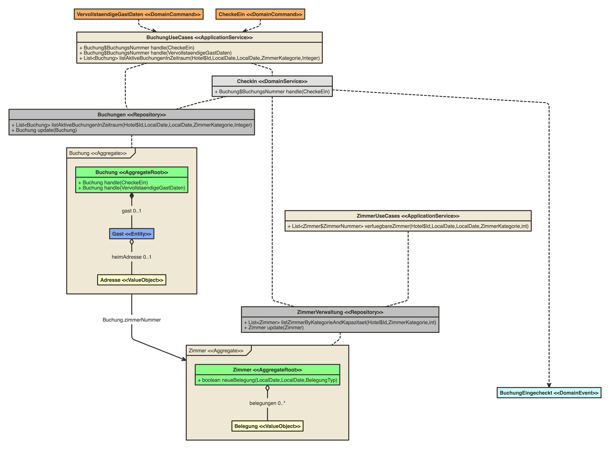
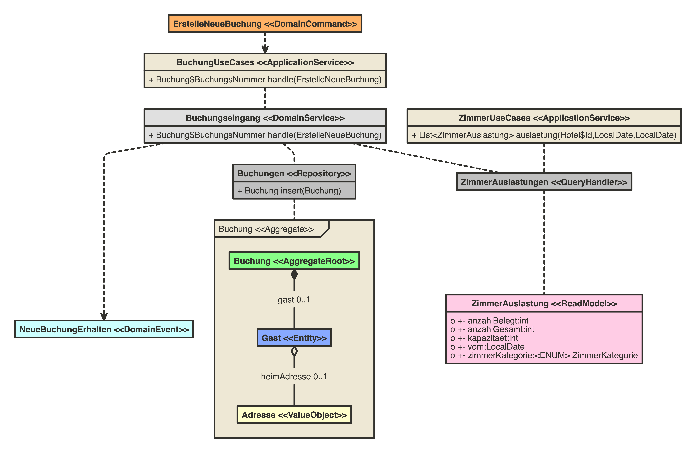
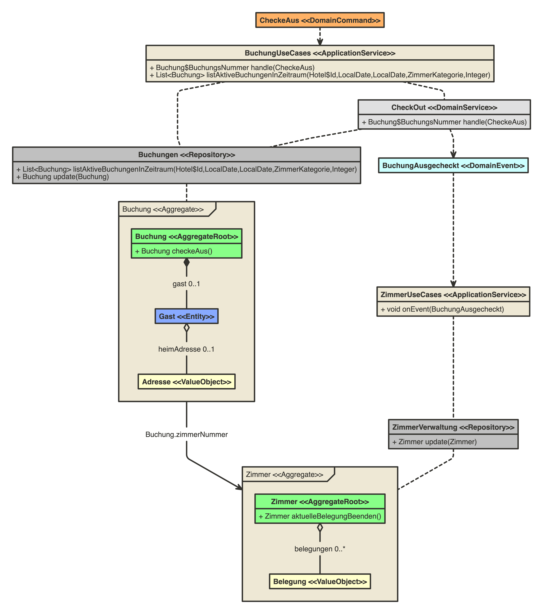
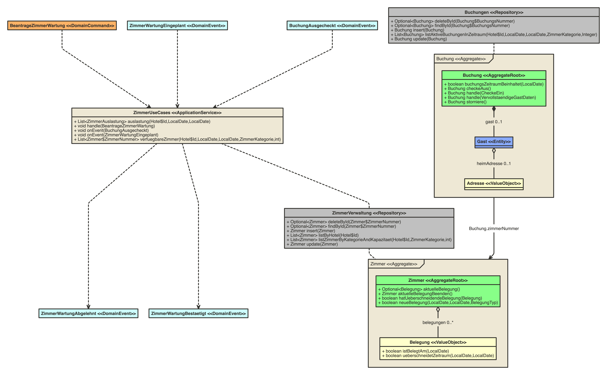
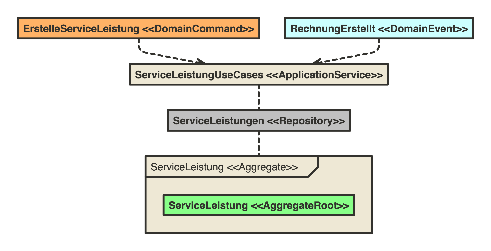

# ddd-hotel-demo

## Szenario

In diesem Demo-Projekt werden Abläufe in der Domäne Hotel-Management abgebildet.
Der Fokus liegt dabei auf Beispielen zum Thema "Aggregate Design" und ergänzenden taktischen DDD-Patterns.

Der im Projekt abgebildete Bounded Context "Rezeptionsservices" bündelt die Domänenlogik 
im Package "<a ref="./src/main/java/com/esentri/rezeption/core">com.esentri.rezeption.core</a>".

Die zentralen demonstrativen Use Cases drehen sich dabei um den CheckIn und CheckOut.

## Objektorientiertes Design

Im Rahmen dieses Beispiels wird ein qualitativ hochwertiges objektorientiertes Design angestrebt, im Gegensatz zum 
klassischen DDD Anti Pattern "Anämisches Domänen Modell" ([Fowler: Anemic Domain Model](https://martinfowler.com/bliki/AnemicDomainModel.html))

Die Gegenüberstellung von [AntiPattern: Reservierung](./src/test/java/antipattern/Reservierung.java)
und [Reservierung](./src/main/java/com/esentri/rezeption/core/domain/reservierung/Reservierung.java) soll dies zusätzlich verdeutlichen.

## Geschäftsregeln 

Beim Aggregate Design spielen die zugrunde liegenden Geschäftsregeln und Invarianten eine wichtige Rolle.

Im Beispiel-Szenario könnte man einige davon ungefähr wie folgt formulieren:

- CheckIn:
  - konkrete Zimmer werden erst bei CheckIn zugeteilt
  - Doppelbelegungen von Zimmern sind zu vermeiden
  - Anzahl Gäste <= Zimmerkapazität
  - Alter Hauptgast in Buchung >= Mindestalter
  - Zimmerbelegung muss Wartungsarbeiten berücksichtigen
  - Buchung canceln nach CheckIn nicht mehr möglich

- CheckOut:
  - Ein Checkout erfordert, dass die Bezahlung sichergestellt ist
  - Alle in Anspruch genommenen Serviceleistungen müssen beim CheckOut abgerechnet werden

Ein Aggregate bildet eine Gruppe von kohäsiver Entities und ValueObjects, 
die als transaktionale Einheit behandelt werden sollen. Idealerweise lassen sich Aggregates so "schneiden", dass die 
zugehörigen Regeln als "echte Invarianten" formuliert werden können und somit immer "wahr" sind und transaktional eingehalten werden.

Die Einhaltung aller Domänen-Regeln im Rahmen von jedem transaktionalen Übergang ist jedoch aus Skalierbarkeits- und Performance- Gründen nicht immer  
ratsam. Tendenziell sollten kleinere Aggregate-Grenzen gewählt werden. In der Folge müssen "Trade-Offs" und Lösungen für andere Wege
zur Einhaltung der Konsistenz gefunden werden, die von einem umfassenden "großen" Aggregats Schnitt abweichen.

## Transactional vs. Eventual Consistency

Eine zentrale Design-Regel für DDD Aggregate lautet: 
- 1 Transaktion bearbeitet schreibend nur genau 1 Aggregate!!!

Dennoch ist diese Regel zwar als zu bevorzugender Weg und eher als Daumen-Regel (Heuristik) zu sehen und nicht als unumstößliches Dogma.
Vaughn Vernon und Eric Evans geben folgende Entscheidungshilfe: Wessen Job ist die Erhaltung der Konsistenz?
Falls die Einhaltung der Konsistenz in den Aufgabenbereich des Users fällt, welcher die Veränderung in der Domäne angestoßen hat, 
kann tendenziell mit "transaktionaler Konsistenz" (d.h. Aggregate-übergreifenden Transaktionen) gearbeitet werden.

Im Demo Projekt wird die "klassische transaktionale Konsistenzerhaltung" beim Check-In dargestellt, wobei die Aggregate
"Reservierung" und "Zimmer" betroffen sind. Sobald eine Reservierung eingecheckt wird, muss ein entsprechendes freies Zimmer belegt werden:

### Transactional
- siehe [CheckInService](./src/main/java/com/esentri/rezeption/core/domain/reservierung/CheckInService.java)

> **_Achtung:_**  
> Im Rahmen des Demo Projekts wurde auf die Implementierung einer relationale Datenhaltung verzichtet.
> Repositories arbeiten lediglich mit einer simplen InMemory Datenhaltung. 
> Transaktionsgrenzen wurden mit der Spring Annotation '@Transactional' angedeutet, werden aber nicht 
> technisch über die Implementierung durchgesetzt.

### Eventual
Eventual Consistency wird über eine "fiktive" externe Applikation zur Verwaltung der Wartungsaktivitäten 
(anderer Bounded Context) dargestellt. Über diese externe Applikation werden Wartungsvorgänge geplant.
Die hier abgebildeteten "Rezeptionsservices" erhalten ein entsprechendes Domain Event und versuchen die entsprechenden 
Zimmer-Belegungen vorzunehmen. Je nach Erfolg werden DomainEvents emittiert, welche die Zimmerbelegung, welche die 
Bestätigung oder Ablehnung der Zimmerbelegungsversuche abbilden.

- siehe [ZimmerDriverImpl.onEvent(ZimmerWartungeingeplant)](./src/main/java/com/esentri/rezeption/inbound/ZimmerDriverImpl.java)

Dies entspricht dem [Saga-Pattern](https://microservices.io/patterns/data/saga.html).

## DomainCommands

DomainCommands bilden Änderungs-Anfragen eines Benutzers oder anderen Systems ab.
Sie können im Gegensatz zu DomainEvents abgelehnt werden oder “fehlschlagen”.
Sie vermitteln die Intention zentraler Operationen explizit, verbessern so Lesbarkeit und Verständlichkeit der Domäne.

In sämtlichen hier dargestellten Klassen-diagrammen sind DomainCommands orange dargestellt. 
Die Verwendung kann in den entsprechenden Stellen im Code idealerweise ausgehen von den Driver-Klassen nachvollzogen werden.

## ReadModels

DDD-Modelle fokussieren auf transaktionale Konsistenz bei Veränderungen an den Domänenobjekten.
In vielen Fällen ist es hilfreich für bestimmte Lese-Anforderungen nicht das Domänen Modell anzupassen 
oder gar "aufzuweichen", sondern spezifische "ReadModels" einzuführen, welche diesen Zweck besser erfüllen.

Man könnte die als "CQRS light" beschreiben. Im Gegensatz zu "full-fledged CQRS" wird nicht für jede Leseanforderung ein dediziertes
Lese-Modell verwendet.

## Weitere abgebildete komplexere Use Cases 

## Weitere Quellen

- Domain-Driven Design: Tackling Complexity in the Heart of Software
Domain-Driven Design: Tackling Complexity in the Heart of Software, Eric Evans, 2003
- Implementing Domain-Driven Design, Vaughn Vernon, 2013
- https://www.domainlanguage.com/wp-content/uploads/2016/05/DDD_Reference_2015-03.pdf

- https://www.archi-lab.io/infopages/ddd/aggregate-design-rules-vernon.html

- https://github.com/ddd-crew/aggregate-design-canvas?tab=readme-ov-file

- https://enterprisecraftsmanship.com/posts/cqrs-commands-part-domain-model/

- http://gorodinski.com/blog/2012/04/25/read-models-as-a-tactical-pattern-in-domain-driven-design-ddd/

